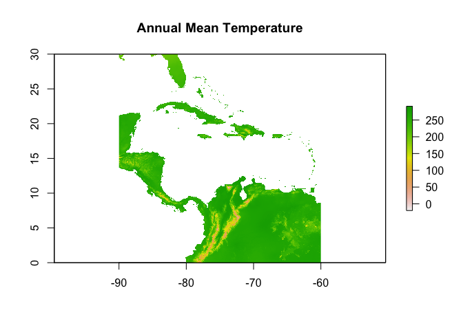
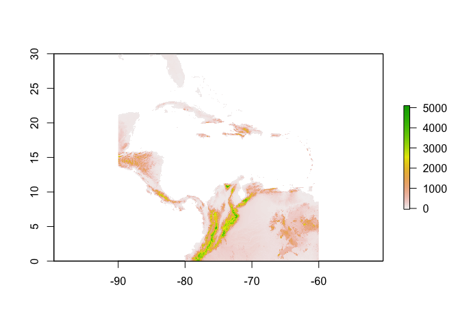
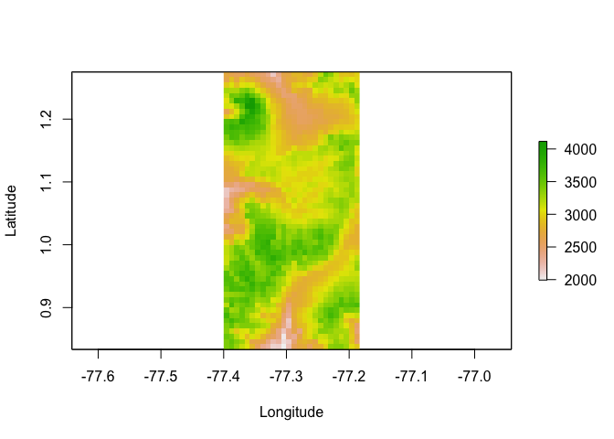

WorldClim\_tutorial for Jankowski Lab Meeting
================
Santiago David
21/03/2022

This file is a short tutorial for extracting Bioclimatic variables from
[WorldClim](https://www.worldclim.org/data/bioclim.html) for a set of
coordinates.

Most of the code is product of an ongoing collaboration with
undergraduate student Juan Carlos Arias from Universidad Jorge Tadeo
Lozano, Colombia. In this collaboration we are exploring a morphologial
database of Paramo birds to test a set of questions about community
composition and diversity across paramos.

Reference: Montoya, P., Gonzalez, M. A., Tenorio, E. A., López‐Ordóñez,
J. P., Pinto Gómez, A., Cueva, D., … & Salgado‐Negret, B. (2018). [A
morphological database for 606 Colombian bird
species](https://esajournals.onlinelibrary.wiley.com/doi/full/10.1002/ecy.2368)

### What’s WorldClim

WorldClim is a database of high spatial resolution global weather and
climate data. These data are available at four different spatial
resolutions between 30 seconds (~1 km2) to 10 minutes (~340 km2) and for
historical (near current) and future conditions. Depending on your
question you might need data per month or as an average for the years
period (1970-2000). This dataset is widely used and currently has more
than 12000 citations on its [first
version](https://rmets.onlinelibrary.wiley.com/doi/abs/10.1002/joc.1276)
and more than 3000 on its
[second](https://rmets.onlinelibrary.wiley.com/doi/abs/10.1002/joc.5086).
However, there are other global datasets for climatic variables such as
[CMCC-BioClimInd](https://www.nature.com/articles/s41597-020-00726-5).

### Data and packages

First, we load the packages

Now we load the dataset

``` r
data <- read_csv("lacocha.csv")
```

Quick inspection of this dataset

``` r
str(data)
```

    ## spec_tbl_df [243 × 38] (S3: spec_tbl_df/tbl_df/tbl/data.frame)
    ##  $ occurrenceID        : chr [1:243] "IAvH:SSEYC:CHC-DJP-LCP:ANIMALIAPLANTAE:OBSERVACIONHUMANA:I2D-BIO_2015_IN0100:1461" "IAvH:SSEYC:CHC-DJP-LCP:ANIMALIAPLANTAE:OBSERVACIONHUMANA:I2D-BIO_2015_IN0100:1287" "IAvH:SSEYC:CHC-DJP-LCP:ANIMALIAPLANTAE:OBSERVACIONHUMANA:I2D-BIO_2015_IN0100:1473" "IAvH:SSEYC:CHC-DJP-LCP:ANIMALIAPLANTAE:OBSERVACIONHUMANA:I2D-BIO_2015_IN0100:1480" ...
    ##  $ rightsHolder        : chr [1:243] "UDENAR" "UDENAR" "UDENAR" "UDENAR" ...
    ##  $ basisOfRecord       : chr [1:243] "Human observation" "Human observation" "Human observation" "Human observation" ...
    ##  $ institutionCode     : chr [1:243] "IAvH" "IAvH" "IAvH" "IAvH" ...
    ##  $ collectionCode      : chr [1:243] "IAvH" "IAvH" "IAvH" "IAvH" ...
    ##  $ catalogNumber       : chr [1:243] "IAvH:SSEYC:CHC-DJP-LCP:ANIMALIAPLANTAE:OBSERVACIONHUMANA:I2D-BIO_2015_IN0100:1461" "IAvH:SSEYC:CHC-DJP-LCP:ANIMALIAPLANTAE:OBSERVACIONHUMANA:I2D-BIO_2015_IN0100:1287" "IAvH:SSEYC:CHC-DJP-LCP:ANIMALIAPLANTAE:OBSERVACIONHUMANA:I2D-BIO_2015_IN0100:1473" "IAvH:SSEYC:CHC-DJP-LCP:ANIMALIAPLANTAE:OBSERVACIONHUMANA:I2D-BIO_2015_IN0100:1480" ...
    ##  $ recordedBy          : chr [1:243] "Edna Calpa, Yuri Rosero, Carlos Trujillo, Francis Ramirez" "Edna Calpa, Yuri Rosero, Carlos Trujillo, Francis Ramirez" "Edna Calpa, Yuri Rosero, Carlos Trujillo, Francis Ramirez" "Edna Calpa, Yuri Rosero, Carlos Trujillo, Francis Ramirez" ...
    ##  $ Source              : chr [1:243] "Field" "Field" "Field" "Field" ...
    ##  $ Date                : chr [1:243] "12-Jun-15" "11-Mar-15" "26-Jun-15" "18-Jul-15" ...
    ##  $ yearMeasurement     : num [1:243] 2015 2015 2015 2015 2015 ...
    ##  $ Sex                 : chr [1:243] "Undetermined" "Undetermined" "Undetermined" "Undetermined" ...
    ##  $ lifeStage           : chr [1:243] "Not registered" "Not registered" "Not registered" "Not registered" ...
    ##  $ Department          : chr [1:243] "Narino" "Narino" "Narino" "Narino" ...
    ##  $ Municipality        : chr [1:243] "Pasto" "Pasto" "Pasto" "Pasto" ...
    ##  $ ParamoComplex       : chr [1:243] "Complejo de Paramos La Cocha-Patascoy (LCP)" "Complejo de Paramos La Cocha-Patascoy (LCP)" "Complejo de Paramos La Cocha-Patascoy (LCP)" "Complejo de Paramos La Cocha-Patascoy (LCP)" ...
    ##  $ Locality            : chr [1:243] "Narino: Pasto: El Encano , Vda. Santa Lucia" "Narino: Pasto: Santa Barbara, Vda. Los Alisales" "Narino: Pasto: Buesaquillo, Vda. La Cuchilla" "Narino: Pasto: La Merced, Cerro Morasurco" ...
    ##  $ Elevation           : num [1:243] 2810 3389 3430 3280 3280 ...
    ##  $ decimalLatitude     : num [1:243] 0.998 0.982 1.272 1.275 1.275 ...
    ##  $ decimalLongitude    : num [1:243] -77.2 -77.3 -77.2 -77.2 -77.2 ...
    ##  $ Order               : chr [1:243] "Accipitriformes" "Apodiformes" "Apodiformes" "Apodiformes" ...
    ##  $ Family              : chr [1:243] "Accipitridae" "Trochilidae" "Trochilidae" "Trochilidae" ...
    ##  $ Species             : chr [1:243] "Accipiter striatus" "Chalcostigma herrani" "Chalcostigma herrani" "Coeligena lutetiae" ...
    ##  $ Weight              : num [1:243] 100 5.5 NA NA NA 7 7 5.5 7.5 6.5 ...
    ##  $ totalCulmen         : num [1:243] 18 16.3 17 37.6 38 39.8 37.2 31.8 38.3 41 ...
    ##  $ exposedCulmen       : num [1:243] 16.1 12.6 12.4 31 31.3 NA 32.7 32.2 35.2 34.4 ...
    ##  $ billDepth           : num [1:243] 8.2 1.9 1.8 1.5 1.8 1.8 1.9 2.1 1.9 2 ...
    ##  $ billWidth           : num [1:243] NA 2 NA 2 2.4 2.4 2.8 2.2 2.4 3.3 ...
    ##  $ gape                : num [1:243] NA 4.4 2.9 3.2 3.7 4.3 4.5 4.7 4.1 6.2 ...
    ##  $ wingArea            : num [1:243] 2403 125 122 125 180 ...
    ##  $ wingLength          : num [1:243] 172 65 72 75 75 71 72 73 72 74 ...
    ##  $ distPrimarySecondary: num [1:243] 45 NA 33 47 39 41 44 40 52 43 ...
    ##  $ tailLength          : num [1:243] 146 51 58 52 46 42 44 41.4 46 47 ...
    ##  $ tailShape           : num [1:243] NA NA NA 8 11 NA NA 4 NA NA ...
    ##  $ Tarsus              : num [1:243] 48.9 6.5 NA 4.6 6.7 6.6 6 5.5 6 6.5 ...
    ##  $ Hallux              : num [1:243] 17.8 7.8 5.8 5.9 5.8 7.2 7.3 6.6 6.1 4.1 ...
    ##  $ halluxClaw          : logi [1:243] NA NA NA NA NA NA ...
    ##  $ Wingspan            : logi [1:243] NA NA NA NA NA NA ...
    ##  $ Weight_Dunning2008  : num [1:243] 138.4 5.8 5.8 7.3 7.3 ...
    ##  - attr(*, "spec")=
    ##   .. cols(
    ##   ..   occurrenceID = col_character(),
    ##   ..   rightsHolder = col_character(),
    ##   ..   basisOfRecord = col_character(),
    ##   ..   institutionCode = col_character(),
    ##   ..   collectionCode = col_character(),
    ##   ..   catalogNumber = col_character(),
    ##   ..   recordedBy = col_character(),
    ##   ..   Source = col_character(),
    ##   ..   Date = col_character(),
    ##   ..   yearMeasurement = col_double(),
    ##   ..   Sex = col_character(),
    ##   ..   lifeStage = col_character(),
    ##   ..   Department = col_character(),
    ##   ..   Municipality = col_character(),
    ##   ..   ParamoComplex = col_character(),
    ##   ..   Locality = col_character(),
    ##   ..   Elevation = col_double(),
    ##   ..   decimalLatitude = col_double(),
    ##   ..   decimalLongitude = col_double(),
    ##   ..   Order = col_character(),
    ##   ..   Family = col_character(),
    ##   ..   Species = col_character(),
    ##   ..   Weight = col_double(),
    ##   ..   totalCulmen = col_double(),
    ##   ..   exposedCulmen = col_double(),
    ##   ..   billDepth = col_double(),
    ##   ..   billWidth = col_double(),
    ##   ..   gape = col_double(),
    ##   ..   wingArea = col_double(),
    ##   ..   wingLength = col_double(),
    ##   ..   distPrimarySecondary = col_double(),
    ##   ..   tailLength = col_double(),
    ##   ..   tailShape = col_double(),
    ##   ..   Tarsus = col_double(),
    ##   ..   Hallux = col_double(),
    ##   ..   halluxClaw = col_logical(),
    ##   ..   Wingspan = col_logical(),
    ##   ..   Weight_Dunning2008 = col_double()
    ##   .. )

``` r
dim(data)
```

    ## [1] 243  38

This is a subset of the data in Montoya etal. that contains the
observations for a single Paramo Complex and all the variables in the
original dataset. The original dataset contains 9892 entries of 38
variables and includes field museum specimens and field observations.
There is a lot of information on morphological variables, but what we
need is the spatial information (i.e coordinates).

``` r
head(data)
```

    ## # A tibble: 6 × 38
    ##   occurrenceID    rightsHolder basisOfRecord institutionCode collectionCode
    ##   <chr>           <chr>        <chr>         <chr>           <chr>         
    ## 1 IAvH:SSEYC:CHC… UDENAR       Human observ… IAvH            IAvH          
    ## 2 IAvH:SSEYC:CHC… UDENAR       Human observ… IAvH            IAvH          
    ## 3 IAvH:SSEYC:CHC… UDENAR       Human observ… IAvH            IAvH          
    ## 4 IAvH:SSEYC:CHC… UDENAR       Human observ… IAvH            IAvH          
    ## 5 IAvH:SSEYC:CHC… UDENAR       Human observ… IAvH            IAvH          
    ## 6 IAvH:SSEYC:CHC… UDENAR       Human observ… IAvH            IAvH          
    ## # … with 33 more variables: catalogNumber <chr>, recordedBy <chr>,
    ## #   Source <chr>, Date <chr>, yearMeasurement <dbl>, Sex <chr>,
    ## #   lifeStage <chr>, Department <chr>, Municipality <chr>,
    ## #   ParamoComplex <chr>, Locality <chr>, Elevation <dbl>,
    ## #   decimalLatitude <dbl>, decimalLongitude <dbl>, Order <chr>,
    ## #   Family <chr>, Species <chr>, Weight <dbl>, totalCulmen <dbl>,
    ## #   exposedCulmen <dbl>, billDepth <dbl>, billWidth <dbl>, gape <dbl>, …

We use Tidyverse to explore how many localities and combinations of
longitude, latitude and elevation we have

``` r
data %>% 
  distinct(Locality, Elevation, decimalLongitude, decimalLatitude)
```

    ## # A tibble: 15 × 4
    ##    Locality                      Elevation decimalLatitude decimalLongitude
    ##    <chr>                             <dbl>           <dbl>            <dbl>
    ##  1 Narino: Pasto: El Encano , V…      2810           0.998            -77.2
    ##  2 Narino: Pasto: Santa Barbara…      3389           0.982            -77.3
    ##  3 Narino: Pasto: Buesaquillo, …      3430           1.27             -77.2
    ##  4 Narino: Pasto: La Merced, Ce…      3280           1.27             -77.2
    ##  5 Narino: Puerres: Monopamba, …      2938           0.833            -77.4
    ##  6 Narino: Puerres: Monopamba, …      3170           0.839            -77.4
    ##  7 Narino: Pasto: El Socorro Ci…      3336           1.12             -77.2
    ##  8 Narino: Pasto: Santa Barbara…      3211           0.977            -77.3
    ##  9 Narino: Pasto: El Socorro Ci…      3271           1.12             -77.2
    ## 10 Narino: Pasto: Santa Barbara…      3140           0.970            -77.3
    ## 11 Narino: Puerres: Puerres, Vd…      3356           0.843            -77.4
    ## 12 Narino: Puerres: Monopamba, …      3300           0.842            -77.4
    ## 13 Narino: Pasto: El Socorro Ci…      3211           1.12             -77.2
    ## 14 Narino: Pasto: Buesaquillo, …      3504           1.27             -77.2
    ## 15 Narino: Tangua: Santander , …      3504           0.987            -77.3

Now, we can create a subset of unique localities by extracting a
distinct combination of longitudes and latitudes, and keeping other
relevant geographic information

``` r
coordinates <- data %>% 
  distinct(decimalLongitude, decimalLatitude, Elevation, ParamoComplex, Department, Locality)
head(coordinates)
```

    ## # A tibble: 6 × 6
    ##   Department ParamoComplex               Locality Elevation decimalLatitude
    ##   <chr>      <chr>                       <chr>        <dbl>           <dbl>
    ## 1 Narino     Complejo de Paramos La Coc… Narino:…      2810           0.998
    ## 2 Narino     Complejo de Paramos La Coc… Narino:…      3389           0.982
    ## 3 Narino     Complejo de Paramos La Coc… Narino:…      3430           1.27 
    ## 4 Narino     Complejo de Paramos La Coc… Narino:…      3280           1.27 
    ## 5 Narino     Complejo de Paramos La Coc… Narino:…      2938           0.833
    ## 6 Narino     Complejo de Paramos La Coc… Narino:…      3170           0.839
    ## # … with 1 more variable: decimalLongitude <dbl>

We can use **leaflet** to quickly visualize these localities in a map
and confirm that they are where we think they are

``` r
leaflet(data = coordinates) %>% 
  addProviderTiles(providers$Esri.NatGeoWorldMap) %>% 
  addCircleMarkers(~decimalLongitude, ~decimalLatitude) %>% 
  addRectangles(
    lng1=min(coordinates$decimalLongitude), lat1=min(coordinates$decimalLatitude),
    lng2=max(coordinates$decimalLongitude), lat2=max(coordinates$decimalLatitude)
  )
```

<!--html_preserve-->

<div id="htmlwidget-b480f3d27b584770ebef" class="leaflet html-widget" style="width:672px;height:480px;">

</div>

<script type="application/json" data-for="htmlwidget-b480f3d27b584770ebef">{"x":{"options":{"crs":{"crsClass":"L.CRS.EPSG3857","code":null,"proj4def":null,"projectedBounds":null,"options":{}}},"calls":[{"method":"addProviderTiles","args":["Esri.NatGeoWorldMap",null,null,{"errorTileUrl":"","noWrap":false,"detectRetina":false}]},{"method":"addCircleMarkers","args":[[0.99775,0.982361,1.271922,1.274972,0.832639,0.839306,1.120361,0.976694,1.119194,0.969972,0.843194,0.842222,1.121556,1.271042,0.987361],[-77.181333,-77.295139,-77.246667,-77.242117,-77.352111,-77.361278,-77.215917,-77.290028,-77.218361,-77.288472,-77.396722,-77.366861,-77.222194,-77.238869,-77.293528],10,null,null,{"interactive":true,"className":"","stroke":true,"color":"#03F","weight":5,"opacity":0.5,"fill":true,"fillColor":"#03F","fillOpacity":0.2},null,null,null,null,null,{"interactive":false,"permanent":false,"direction":"auto","opacity":1,"offset":[0,0],"textsize":"10px","textOnly":false,"className":"","sticky":true},null]},{"method":"addRectangles","args":[0.832639,-77.396722,1.274972,-77.181333,null,null,{"interactive":true,"className":"","stroke":true,"color":"#03F","weight":5,"opacity":0.5,"fill":true,"fillColor":"#03F","fillOpacity":0.2,"smoothFactor":1,"noClip":false},null,null,null,{"interactive":false,"permanent":false,"direction":"auto","opacity":1,"offset":[0,0],"textsize":"10px","textOnly":false,"className":"","sticky":true},null]}],"limits":{"lat":[0.832639,1.274972],"lng":[-77.396722,-77.181333]}},"evals":[],"jsHooks":[]}</script>

<!--/html_preserve-->

### WorldClim data for these coordinates

Now, we have a set of coordinates that we need WorldClim data for.

We can use package **raster** to download raster data from Worldclim
using the `raster::getData` function. You can read more documentation
[here](https://www.rdocumentation.org/packages/raster/versions/3.5-15/topics/getData).

To download the data we need to supply which database we want, the
variable(s) we are interested in, the resolution (in minutes), and a
coordinate that is within the general area we are interested in. We do
this, because we just need the chunk (or tile) of the WorldClim dataset
that is relevant to our set of coordinates.

In our case, I’m interested in the lowest resolution possible that I can
get data for, in worldclim that means 30 seconds (or 0.5). Also I want
all 19 variables averaged annually not the montly data for a single
variable (i.e. `var = "bio"`. Finally, for this resolution I must
provide a reference lon and lat. I will do the same to extract elevation
data from WorldClim for this same
tile/resolution.

``` r
climate <- getData("worldclim", var = "bio", res = 0.5, lon = -77, lat = 1)
elevation <- getData("worldclim", var="alt", res=0.5, lon=-77, lat=1)
```

This last step downloaded the data into our project folder as a zip
file, and also create r objects for them in our environment. What kind
of objects?

``` r
class(climate)
```

    ## [1] "RasterStack"
    ## attr(,"package")
    ## [1] "raster"

``` r
unlist(climate)
```

    ## class      : RasterStack 
    ## dimensions : 3600, 3600, 12960000, 19  (nrow, ncol, ncell, nlayers)
    ## resolution : 0.008333333, 0.008333333  (x, y)
    ## extent     : -90, -60, -3.332445e-12, 30  (xmin, xmax, ymin, ymax)
    ## crs        : +proj=longlat +datum=WGS84 
    ## names      : bio1_23, bio2_23, bio3_23, bio4_23, bio5_23, bio6_23, bio7_23, bio8_23, bio9_23, bio10_23, bio11_23, bio12_23, bio13_23, bio14_23, bio15_23, ...

Now, we can use this to visualize, for example, the Mean Temperature in
the specific geographic tile we extracted from
WorldClim

``` r
plot(climate$bio1_23, main = "Annual Mean Temperature")
```

<!-- -->

You will notice that temperatures are in the order of ~100’s C. This is
because WorldClim store temperatures as C\*10 to reduce download time
and file size. So, be careful and transform temperatures when needed.

visualize the elevation
profile

``` r
plot(elevation)
```

<!-- -->

I can also visualize this for the specific set of coordinates we have,
which is a smaller “tile” than the one we extracted

``` r
plot(elevation, xlab="Longitude", ylab="Latitude", 
     ylim=c(min(coordinates$decimalLatitude), max(coordinates$decimalLatitude)),
     xlim=c(min(coordinates$decimalLongitude), max(coordinates$decimalLongitude)))
```

<!-- -->

However what we need is the specific climate data for each one of our
set of coordinates. So, the first step here is to create spatial
projections of our flat set of coordinates so that they are in a similar
format to that of the climate
data.

``` r
points <- SpatialPoints(coordinates[,c("decimalLongitude","decimalLatitude")])
unlist(points)
```

    ## class       : SpatialPoints 
    ## features    : 15 
    ## extent      : -77.39672, -77.18133, 0.832639, 1.274972  (xmin, xmax, ymin, ymax)
    ## crs         : NA

Now, we extract the 19 variables for each set of coordinates in our
`points`. Remember we have 15 unique combinations of coordinates.

``` r
variables <- extract(climate, points)
```

And finally we bind the climatic variables to the coordinates subset

``` r
env_data <- cbind.data.frame(coordinates, variables)
print(env_data)
```

    ##    Department                               ParamoComplex
    ## 1      Narino Complejo de Paramos La Cocha-Patascoy (LCP)
    ## 2      Narino Complejo de Paramos La Cocha-Patascoy (LCP)
    ## 3      Narino Complejo de Paramos La Cocha-Patascoy (LCP)
    ## 4      Narino Complejo de Paramos La Cocha-Patascoy (LCP)
    ## 5      Narino Complejo de Paramos La Cocha-Patascoy (LCP)
    ## 6      Narino Complejo de Paramos La Cocha-Patascoy (LCP)
    ## 7      Narino Complejo de Paramos La Cocha-Patascoy (LCP)
    ## 8      Narino Complejo de Paramos La Cocha-Patascoy (LCP)
    ## 9      Narino Complejo de Paramos La Cocha-Patascoy (LCP)
    ## 10     Narino Complejo de Paramos La Cocha-Patascoy (LCP)
    ## 11     Narino Complejo de Paramos La Cocha-Patascoy (LCP)
    ## 12     Narino Complejo de Paramos La Cocha-Patascoy (LCP)
    ## 13     Narino Complejo de Paramos La Cocha-Patascoy (LCP)
    ## 14     Narino Complejo de Paramos La Cocha-Patascoy (LCP)
    ## 15     Narino Complejo de Paramos La Cocha-Patascoy (LCP)
    ##                                                  Locality Elevation
    ## 1             Narino: Pasto: El Encano , Vda. Santa Lucia      2810
    ## 2         Narino: Pasto: Santa Barbara, Vda. Los Alisales      3389
    ## 3            Narino: Pasto: Buesaquillo, Vda. La Cuchilla      3430
    ## 4               Narino: Pasto: La Merced, Cerro Morasurco      3280
    ## 5         Narino: Puerres: Monopamba, Vda. Desmontes Alto      2938
    ## 6         Narino: Puerres: Monopamba, Vda. Desmontes Alto      3170
    ## 7  Narino: Pasto: El Socorro Cimarron, Vda. Bajo Casanare      3336
    ## 8         Narino: Pasto: Santa Barbara, Vda. Los Alisales      3211
    ## 9  Narino: Pasto: El Socorro Cimarron, Vda. Bajo Casanare      3271
    ## 10        Narino: Pasto: Santa Barbara, Vda. Los Alisales      3140
    ## 11                Narino: Puerres: Puerres, Vda. El Rosal      3356
    ## 12        Narino: Puerres: Monopamba, Vda. Desmontes Alto      3300
    ## 13 Narino: Pasto: El Socorro Cimarron, Vda. Bajo Casanare      3211
    ## 14           Narino: Pasto: Buesaquillo, Vda. La Cuchilla      3504
    ## 15            Narino: Tangua: Santander , Vda. Las Palmas      3504
    ##    decimalLatitude decimalLongitude bio1_23 bio2_23 bio3_23 bio4_23
    ## 1         0.997750        -77.18133     122      89      89     406
    ## 2         0.982361        -77.29514      85      84      87     446
    ## 3         1.271922        -77.24667     102      84      90     343
    ## 4         1.274972        -77.24212     102      84      90     343
    ## 5         0.832639        -77.35211     120      94      87     485
    ## 6         0.839306        -77.36128     107      91      86     478
    ## 7         1.120361        -77.21592      86      83      89     448
    ## 8         0.976694        -77.29003      83      84      87     457
    ## 9         1.119194        -77.21836      97      84      89     421
    ## 10        0.969972        -77.28847     104      87      87     442
    ## 11        0.843194        -77.39672      88      86      86     461
    ## 12        0.842222        -77.36686      94      88      88     463
    ## 13        1.121556        -77.22219      97      84      89     421
    ## 14        1.271042        -77.23887      82      83      90     376
    ## 15        0.987361        -77.29353      82      84      87     475
    ##    bio5_23 bio6_23 bio7_23 bio8_23 bio9_23 bio10_23 bio11_23 bio12_23
    ## 1      173      73     100     120     124      125      116     1378
    ## 2      135      39      96      82      86       88       77     1849
    ## 3      150      57      93     105     102      105       96     1840
    ## 4      150      57      93     105     102      105       96     1840
    ## 5      174      66     108     116     122      123      112     1263
    ## 6      161      56     105     104     109      111      100     1384
    ## 7      135      42      93      84      87       90       79     2055
    ## 8      133      37      96      80      84       86       75     1887
    ## 9      145      51      94      94      98      101       90     1927
    ## 10     155      56      99     102     105      108       97     1573
    ## 11     140      41      99      84      89       91       80     1594
    ## 12     147      47     100      91      96       98       87     1548
    ## 13     145      51      94      94      98      101       90     1927
    ## 14     130      38      92      84      83       85       76     2067
    ## 15     132      36      96      79      83       85       74     1878
    ##    bio13_23 bio14_23 bio15_23 bio16_23 bio17_23 bio18_23 bio19_23
    ## 1       147       85       16      406      279      386      350
    ## 2       211      108       21      593      340      536      491
    ## 3       202      117       18      550      383      550      408
    ## 4       202      117       18      550      383      550      408
    ## 5       143       82       17      366      253      303      330
    ## 6       150       89       17      410      273      324      357
    ## 7       237      118       22      666      374      593      551
    ## 8       219      110       22      610      345      545      506
    ## 9       211      115       20      603      362      560      500
    ## 10      170       98       18      476      303      455      406
    ## 11      172       98       19      488      306      468      450
    ## 12      168       95       19      473      297      451      398
    ## 13      211      115       20      603      362      560      500
    ## 14      220      124       19      635      398      606      570
    ## 15      215      110       22      604      345      545      498

We have now a new dataset with the localities information from the
original dataset and bioclimatic variables for each coordinates.

**NOTE**: There are many examples and information online to deal with
WorldClim data in R. I recommend exploring these two
[here](https://emilypiche.github.io/BIO381/raster.html) and
[here](https://www.gis-blog.com/r-raster-data-acquisition/) from where I
partially reproduced code for this short exercise.
